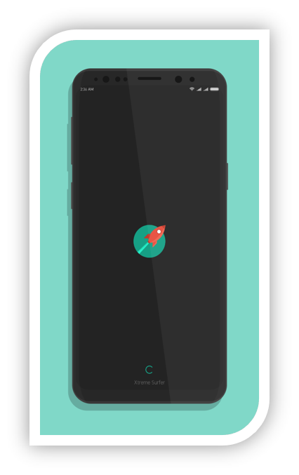
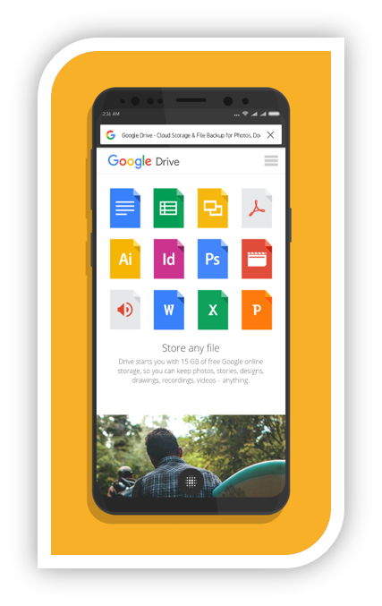
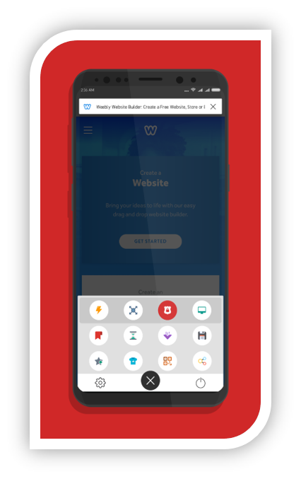
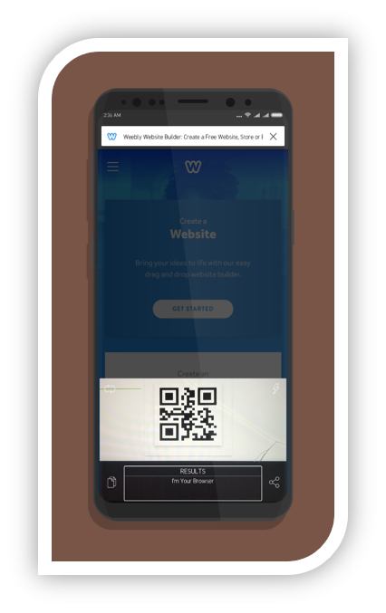
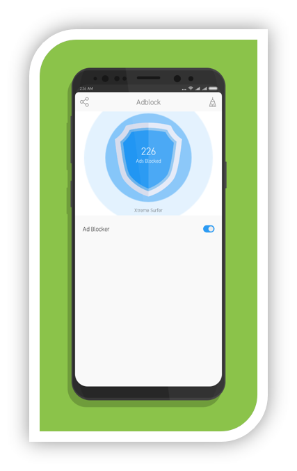
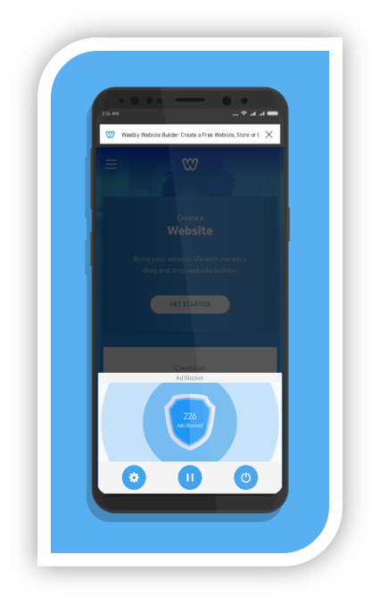

# Surfer Browser
**Surfer** is a modern web browser mobile application, based on **Google Chromium Webview** API hence, fast enough for all browsing needs. Chromium API is an open source library that is actually being used in Google’s own browser **Google Chrome**, so Surfer’s speed is quite predictable.

## Features
-	Built-in ad blocker, that filters out all annoying ads for a clean user experience.
-	Built-in QR scanner, to dive into website without having to type it manually.
-	Stunning user interface, to keep you enchanted while browsing through web.
-	Built-in Theme Engine, for a daily dose of unique appearance.
-	Seamless voice controls, for navigating between websites smoothly.

### Speed
Waiting for loading webpage is not the case for **Surfer Browser**. It can handle all network conditions easily, as intelligent caching mechanism offered by **Google Chromium Webview** API is just perfect. **Surfer browser** is powered by this API hence, no more lags, no more waiting while browsing the web. 

## Screenshots

